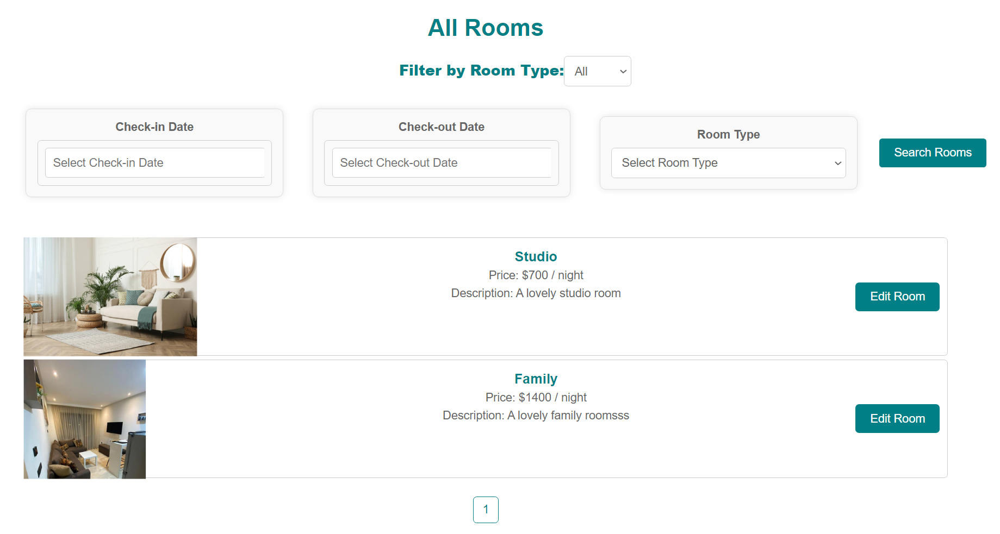

# 🏨 Système de Gestion Hôtelière

Une application full-stack moderne pour la gestion complète d'un hôtel, incluant les réservations, la gestion des chambres et l'administration des utilisateurs.


## 🎯 Aperçu

Ce projet est une solution de gestion hôtelière permettant :
- La réservation de chambres en ligne
- La gestion administrative des chambres et réservations
- Un système d'authentification sécurisé avec JWT
- Un tableau de bord administrateur 
- La gestion des profils utilisateurs

## ✨ Fonctionnalités

### 👥 Pour les utilisateurs
- Inscription et authentification sécurisée
- Recherche et consultation des chambres disponibles
- Réservation de chambres avec sélection de dates
- Gestion du profil personnel
- Historique des réservations
- Recherche de réservations par code de confirmation

### 🔐 Pour les administrateurs
- Tableau de bord administrateur
- Gestion complète des chambres (CRUD)
- Gestion des réservations
- Gestion des utilisateurs
- Upload d'images pour les chambres (AWS S3)
- Statistiques et rapports

## 🏗️ Architecture

Le projet suit une architecture **client-serveur** avec séparation claire des responsabilités :

```
Gestion-Hotellière/
├── back-end/             
│   ├── src/
│   │   ├── main/
│   │   │   ├── java/
│   │   │   │   └── org/sid/hotel/
│   │   │   │       ├── config/       #(CORS, Security, Web)
│   │   │   │       ├── controller/  
│   │   │   │       ├── dto/          
│   │   │   │       ├── entity/       
│   │   │   │       ├── exception/    
│   │   │   │       ├── repo/         #repositories
│   │   │   │       ├── security/     
│   │   │   │       ├── service/     
│   │   │   │       └── utils/       
│   │   │   └── resources/
│   │   │       └── application.properties
│   │   └── test/
│   └── pom.xml
│
└── front-end/             
    ├── public/
    │   └── assets/       
    ├── src/
    │   ├── component/
    │   │   ├── admin/     #pages d'admin
    │   │   ├── auth/      #login & Register
    │   │   ├── booking_rooms/  #réservations
    │   │   ├── common/    #composants réutilisables
    │   │   ├── home/      #page d'accueil
    │   │   └── profile/   #gestion du profil
    │   ├── service/
    │   │   ├── ApiService.js   #appels API
    │   │   └── guard.js        #protection des routes
    │   ├── App.js
    │   └── index.js
    └── package.json
```

## 🛠️ Technologies utilisées

### Backend
- **Framework**: Spring Boot 3.3.2
- **Langage**: Java 21
- **Base de données**: MySQL 8.0
- **ORM**: Spring Data JPA / Hibernate
- **Sécurité**: Spring Security + JWT 
- **Validation**: Spring Boot Validation
- **Build**: Maven

### Frontend
- **Framework**: React 18
- **Routing**: React Router DOM 
- **HTTP Client**: Axios 1.7.7
- **Date Picker**: React DatePicker
- **Styling**: CSS personnalisé

### Outils de développement
- **IDE Backend**: IntelliJ IDEA
- **IDE Frontend**: VS Code
- **Version Control**: Git

## 🚀 Installation

### 1. Cloner le repository

```bash
git clone https://github.com/Omega-Hopkin/gestion-hoteliere.git
cd gestion-hoteliere
```

### 2. Configuration de la base de données

Créer la base de données MySQL :

```sql
CREATE DATABASE hotel;
CREATE USER 'springuser'@'localhost' IDENTIFIED BY '-PASSWORD-';
GRANT ALL PRIVILEGES ON hotel.* TO 'springuser'@'localhost';
FLUSH PRIVILEGES;
```

### 3. Backend - Spring Boot

```bash
cd back-end

# Installer les dépendances
mvn clean install

# Lancer l'application
mvn spring-boot:run
```

Le backend accessible sur `http://localhost:8080`

### 4. Frontend - React

```bash
cd front-end

# Installer les dépendances
npm install

# Lancer l'application
npm start
```

Le frontend sera accessible sur `http://localhost:3000`

## ⚙️ Configuration

### Backend - application.properties

Créer un fichier `application.properties` dans `back-end/src/main/resources/` :

```properties
# Application
spring.application.name=hotel

# Database Configuration
spring.datasource.url=jdbc:mysql://localhost:3306/hotel
spring.datasource.username=springuser
spring.datasource.password=password
spring.jpa.hibernate.ddl-auto=update
spring.jpa.database-platform=org.hibernate.dialect.MySQL8Dialect
spring.datasource.driver-class-name=com.mysql.cj.jdbc.Driver
spring.jpa.open-in-view=false

# AWS S3 Configuration est Optionnel)
# JWT Secret
# jwt.secret=CLE_SECRETE
# jwt.expiration=DATE_EN_MS
```

### Frontend - Variables d'environnement

Créer un fichier `.env` dans `front-end/` (optionnel) :

```env
REACT_APP_API_URL=http://localhost:8080
```

## 💻 Utilisation

### Accès à l'application

1. **Page d'accueil** : `http://localhost:3000/home`
2. **Inscription** : `http://localhost:3000/register`
3. **Connexion** : `http://localhost:3000/login`
4. **Panel Admin** : `http://localhost:3000/admin` 

### Comptes de test

Après le premier lancement, vous pouvez créer un compte admin via l'inscription, puis modifier le role directement en base de données :

```sql
UPDATE user SET role = 'ADMIN' WHERE email = 'email...';
```

## 📡 API Endpoints

### Authentication
```
POST   /auth/register          - Inscription
POST   /auth/login             - Connexion
```

### Users
```
GET    /users/all              - Liste tous les utilisateurs (ADMIN)
GET    /users/get-by-id/{id}   - Obtenir un utilisateur
GET    /users/get-logged-in-profile-info  - Profil de l'utilisateur connecté
GET    /users/get-user-bookings/{id}      - Réservations d'un utilisateur
DELETE /users/delete/{id}      - Supprimer un utilisateur (ADMIN)
```

### Rooms
```
POST   /rooms/add              - Ajouter une chambre (ADMIN)
GET    /rooms/all              - Liste toutes les chambres
GET    /rooms/types            - Types de chambres disponibles
GET    /rooms/room-by-id/{id}  - Détails d'une chambre
GET    /rooms/available-rooms  - Chambres disponibles par dates
PUT    /rooms/update/{id}      - Modifier une chambre (ADMIN)
DELETE /rooms/delete/{id}      - Supprimer une chambre (ADMIN)
```

### Bookings
```
POST   /bookings/book-room/{roomId}/{userId}  - Créer une réservation
GET    /bookings/all                          - Toutes les réservations (ADMIN)
GET    /bookings/get-by-confirmation-code/{code}  - Trouver par code
DELETE /bookings/cancel/{id}                  - Annuler une réservation
```

## 📸 Screenshots

### Page d'accueil


### Chambres disponibles


### Panel administrateur


### Page d'enregistrement


## 📝 Améliorations futures

- [ ] Ajouter la documentation Swagger/OpenAPI 
- [ ] Intégrer Docker & Docker Compose
- [ ] Ajouter des tests unitaires et d'intégration
- [ ] Mettre en place un pipeline CI/CD 
- [ ] Ajouter un système de notifications email
- [ ] Implémenter le paiement en ligne avec Stripe
- [ ] Ajouter un système de reviews/ratings
- [ ] Dashboard avec graphiques et statistiques
- [ ] Amérliorer l'interface
- [ ] Export des données (PDF, Excel)
- [ ] Multi-langue (i18n)
